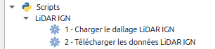
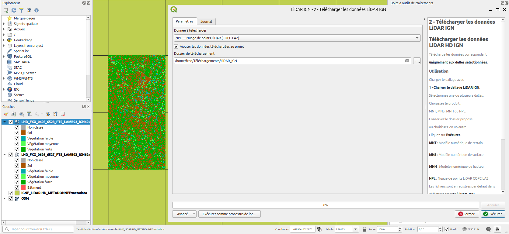

# LiDAR HD IGN pour QGIS

Deux scripts Processing pour QGIS qui permettent de choisir des dalles du
[LiDAR HD de l'IGN](https://geoservices.ign.fr/lidarhd) directement sur la
carte, puis de télécharger les produits correspondants et de les ajouter au
projet.

| Script | Nom dans la boîte à outils |
|---|---|
| `charger_dallage_lidar_ign.py` | **1 - Charger le dallage LiDAR IGN** |
| `telechargement_lidar_ign.py` | **2 - Télécharger les données LiDAR IGN** |

Les deux scripts apparaissent dans le groupe **LiDAR IGN** de la boîte à
outils Processing.

## Produits disponibles

| Code | Produit | Format |
|---|---|---|
| MNT | Modèle numérique de terrain | GeoTIFF |
| MNS | Modèle numérique de surface | GeoTIFF |
| MNH | Modèle numérique de hauteur | GeoTIFF |
| NPL | Nuage de points LiDAR | COPC.LAZ |

## Prérequis

- QGIS 3.36 ou plus récent (utilisation de `Qgis.ProcessingAlgorithmFlag`)
- Une connexion Internet (accès à `data.geopf.fr`)

## Installation

**Option 1 : depuis QGIS**

1. Ouvrir la boîte à outils Processing.
2. Cliquer sur l'icône Python, puis sur **Ajouter un script à la boîte à outils…**
3. Sélectionner les deux fichiers `.py`.

**Option 2 : copie manuelle**

Copier les deux fichiers `.py` dans le dossier des scripts Processing du
profil QGIS :

- Linux : `~/.local/share/QGIS/QGIS3/profiles/default/processing/scripts/`
- Windows : `%APPDATA%\QGIS\QGIS3\profiles\default\processing\scripts\`
- macOS : `~/Library/Application Support/QGIS/QGIS3/profiles/default/processing/scripts/`

Puis redémarrer QGIS.

## Utilisation

1. Lancer **1 - Charger le dallage LiDAR IGN**.
   La couche WFS `IGNF_LIDAR-HD_METADONNEE:metadata`, qui contient
   l'emprise des dalles, est ajoutée au projet (EPSG:2154).
2. Zoomer sur la zone voulue. Seules les dalles de la zone affichée sont
   demandées au serveur.
3. Sélectionner une ou plusieurs dalles dans cette couche.
4. Lancer **2 - Télécharger les données LiDAR IGN** et choisir :
   - le produit (MNT, MNS, MNH ou NPL) ;
   - le dossier de destination (par défaut `Téléchargements/LiDAR_IGN`) ;
   - s'il faut ajouter les fichiers téléchargés au projet.
5. Cliquer sur **Exécuter**.

Seules les dalles sélectionnées sont téléchargées. Les fichiers déjà présents
dans le dossier ne sont pas téléchargés à nouveau. Un bilan s'affiche à la fin
dans le journal : nombre de dalles téléchargées, déjà présentes, ajoutées au
projet, et nombre d'erreurs.

## Remarques

- Au chargement du dallage, QGIS peut afficher l'avertissement *« L'emprise
  retournée par le serveur est incorrecte »*. Il vient du service WFS et
  n'empêche pas l'utilisation : il suffit de zoomer sur la zone voulue sans
  utiliser « Zoomer sur la couche ».
- Les nuages de points (NPL) sont volumineux : quelques centaines de Mo par
  dalle.

## Sources des données

Données © [IGN](https://www.ign.fr/) : LiDAR HD, diffusées par la
[Géoplateforme](https://geoservices.ign.fr/) sous
[Licence Ouverte Etalab 2.0](https://www.etalab.gouv.fr/licence-ouverte-open-licence/).
